<p align="center">
  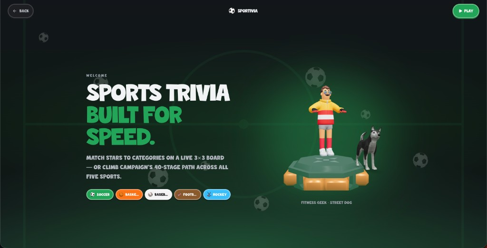
</p>

<h1 align="center">Sportivia</h1>

<p align="center">
  <strong>Sports trivia built for speed.</strong><br />
  Match stars to categories on a live 3×3 board — or climb a 40-stage Campaign across soccer, basketball, baseball, football, and hockey.
</p>

<p align="center">
  <a href="https://sportivia.xyz/"><strong>Play live → sportivia.xyz</strong></a>
</p>

<p align="center">
  <a href="#play">Play</a> ·
  <a href="#gameplay">Gameplay</a> ·
  <a href="#campaign">Campaign</a> ·
  <a href="#modes">Modes</a> ·
  <a href="#systems">Systems</a> ·
  <a href="#architecture">Architecture</a> ·
  <a href="#local-development">Dev</a> ·
  <a href="#credits">Credits</a>
</p>

<p align="center">
  <a href="https://sportivia.xyz/"></a>
  
  
  
  
  
</p>

---

## The hub

Your home stage — sport-reactive backgrounds, 3D skin + pet on a lit podium, daily spin, cards, store, career, level XP, and gold **Play** / emerald **Campaign** CTAs. Pick a sport from the left rail; first visit starts neutral until you choose.

<p align="center">
  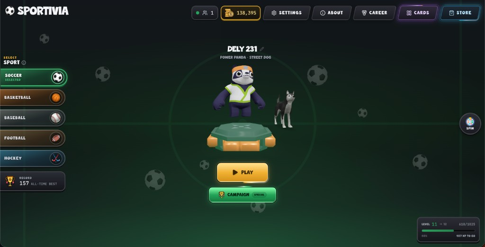
</p>

<table>
  <tr>
    <td width="50%" align="center">
      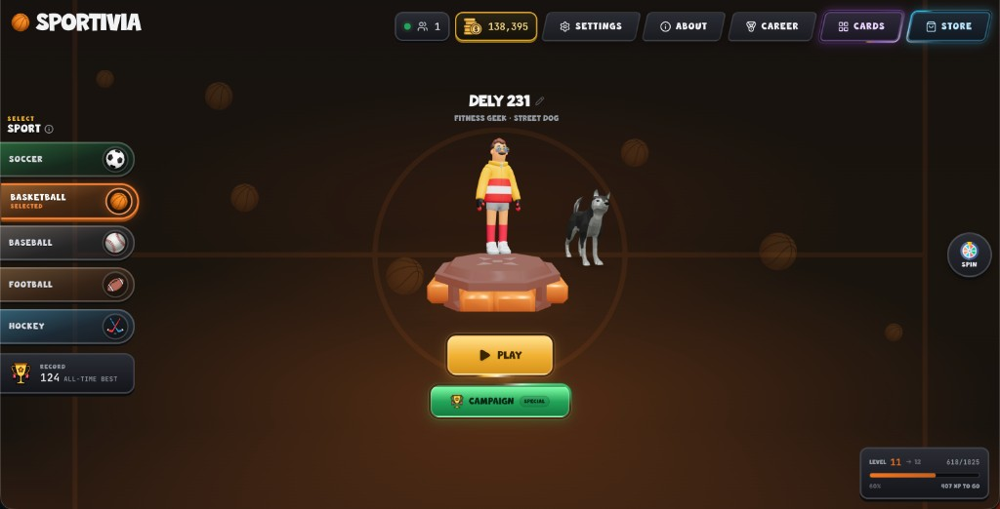<br />
      <sub>Basketball</sub>
    </td>
    <td width="50%" align="center">
      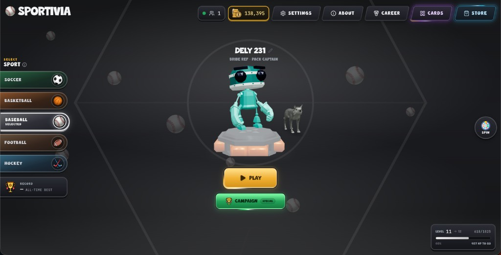<br />
      <sub>Baseball</sub>
    </td>
  </tr>
  <tr>
    <td width="50%" align="center">
      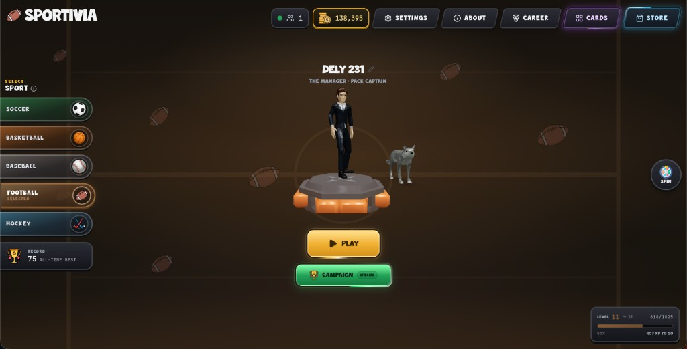<br />
      <sub>Football</sub>
    </td>
    <td width="50%" align="center">
      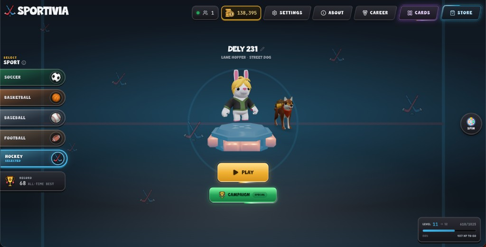<br />
      <sub>Hockey</sub>
    </td>
  </tr>
</table>

Each sport swaps the field background, accent chrome, ball art, and your all-time record on the rail.

---

<a id="campaign"></a>

## Campaign

Sportivia’s long climb — **40 stages** across all five sports, grouped into chapters with gate levels at 10 / 20 / 30 / 40. Player trivia mixes with championship, award, and era curveballs. Earn up to **3★** per stage; **2★+** unlocks the next level. Three-star streaks can **double coin payouts**. Chapter gates pay one-time coin + XP bonuses.

<p align="center">
  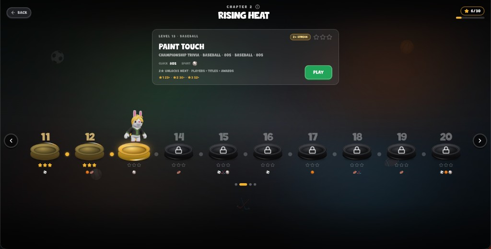
</p>

- **Podium gates** — milestone levels get a special stage presentation.
- **Campaign voice** — optional neural read-aloud for each question (Settings → *Read questions aloud*; needs duel server in dev).
- **Deep trivia pool** — sport-specific championship / award questions layered on top of roster data.

---

## Gameplay

Tap fast. Place the current star into the right category cell. Boards reset after clean cycles. Clock’s ticking.

<p align="center">
  <video src="docs/readme/gameplay.mp4" controls playsinline width="920" poster="docs/readme/gamemodes.png">
    <a href="docs/readme/gameplay.mp4">Watch gameplay</a>
  </video>
</p>

<p align="center">
  <sub>Live board run · <a href="docs/readme/gameplay.mp4">MP4</a> · <a href="docs/readme/gameplay.mov">MOV</a></sub>
</p>

### How a round works

1. A player (or legend) appears with portrait + identity.
2. The **3×3 category grid** shows intersections — clubs, nations, trophies, eras, leagues, and more.
3. You place them before the round timer dies. Correct fills the cell; wrong burns streak and time.
4. Fill the board, ride streaks, beat the clock — or the opponent.

Same rules in every sport. Only the rosters and category language change.

The **About** screen walks through every major feature with short demo clips (board, sports, modes, store, cards, settings, and more).

---

<a id="modes"></a>

## Game modes

<p align="center">
  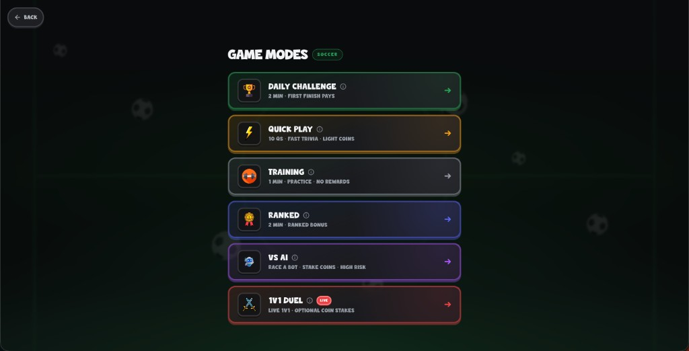
</p>

| Mode | Feel | Payoff |
| --- | --- | --- |
| **Daily Challenge** | Shared board · first finish energy | Daily payday + streak |
| **Quick Play** | 10-question Kahoot-style sprint | Light coins · fast reps |
| **Training** | 1:00 practice sprint | No rewards — pure reps |
| **Ranked** | Competitive solo clock | Ranked bonus + XP |
| **VS AI** | Race Beginner / Pro / Expert bots | Optional coin stakes |
| **1v1 Duel** | Live lobby · optional stakes | Winner takes the pot |
| **Campaign** | 40-stage path · chapter gates | Stars · gate bonuses · streak 2× |

### Live duels

Create or join a lobby code, set an optional stake, ready up, then slam into a **matchup preview** with full portrait cards and PvP records before the board drops.

<table>
  <tr>
    <td width="50%" align="center">
      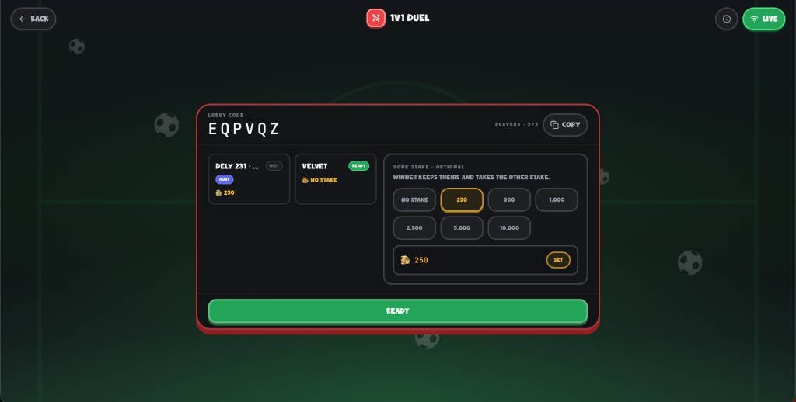<br />
      <sub>Lobby · codes · stakes · ready</sub>
    </td>
    <td width="50%" align="center">
      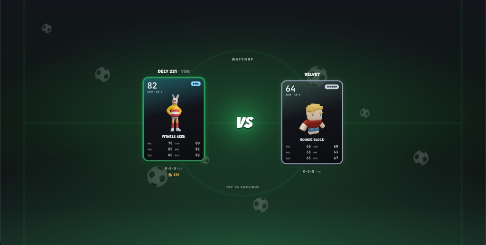<br />
      <sub>Matchup · cards · tap to continue</sub>
    </td>
  </tr>
</table>

Realtime sync runs over **WebSockets** (`ws`) — shared board state, scores, finish flags, and stake settlement.

### Quick Play · Kahoot-style trivia

Portrait up top, four big answer tiles, **8-second clock**, and a running score — **10 questions** per run. Same multiple-choice engine powers Campaign gates. Light coin payout on finish; Daily and Ranked pay more.

<p align="center">
  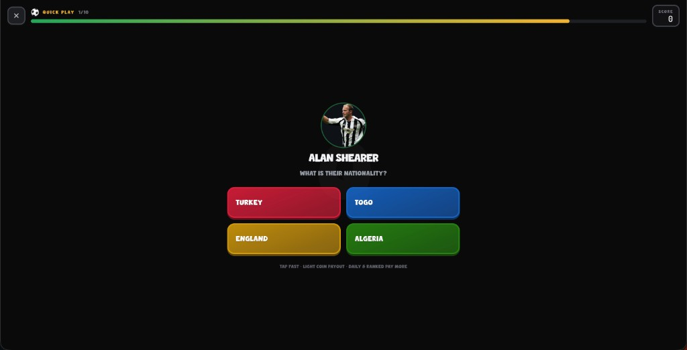
</p>

- **Four choices** — nationality, club, league, position, trophy, decade, and more.
- **Sport-aware pool** — questions pull from the active sport’s roster data.
- **Fast reps** — no board placement; tap the right tile before time runs out.

---

<a id="systems"></a>

## Systems

### Store · skins

Unlock once. Customize forever. Browse 3D skins on pedestals, equip your look, and paint kits — **Boxscore Bob** finishes, **Pro Athlete** jersey colors, **Bribe Ref** per-part paint (eyes, brows, head, body, arms), **Fitness Geek** modular parts, breed variants for **Street Dog**, and more.

<table>
  <tr>
    <td width="50%" align="center">
      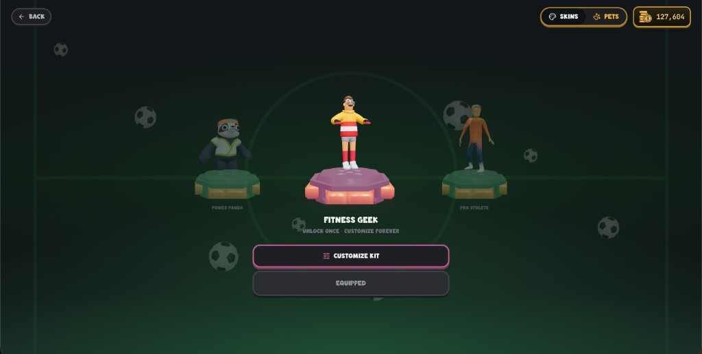<br />
      <sub>Store · skins carousel</sub>
    </td>
    <td width="50%" align="center">
      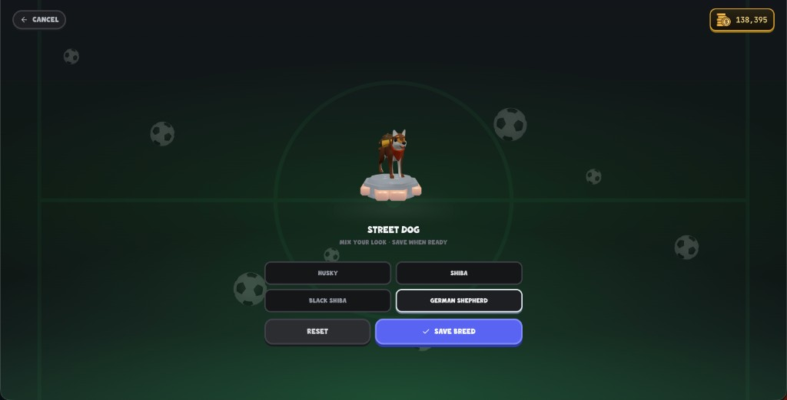<br />
      <sub>Customize · breeds & kits</sub>
    </td>
  </tr>
</table>

Hub skins get **showcase flourishes** — skeletal clips plus procedural root moves (Shadow Stealer vanish steps, Bribe Ref whistle/card shakes, rabbit hops, etc.).

### Pets

Sidekicks for the hub stage — sharks, snakes, dogs, and more. Equip from the store Pets tab.

<p align="center">
  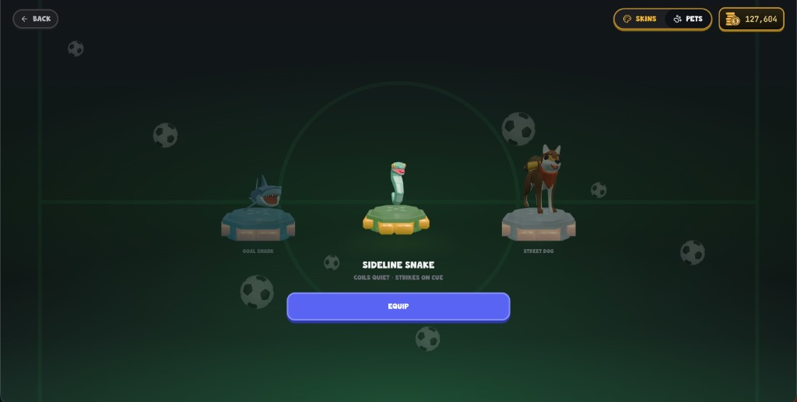
</p>

### Skin cards

FIFA-style cards with PAC / SHO / PAS / DRI / DEF / PHY, rarity tiers, search + filters, queued upgrades, and free-upgrade credits from **Daily Spin**.

<p align="center">
  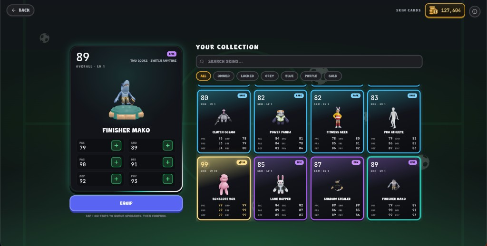
</p>

### Career · settings · economy

Track per-sport records, streaks, and XP. Tune audio, motion, tips, and campaign voice. Spend coins on skins, pets, upgrades, and high-risk bot stakes. Spin once every 24h for coins or free upgrades.

<table>
  <tr>
    <td width="50%" align="center">
      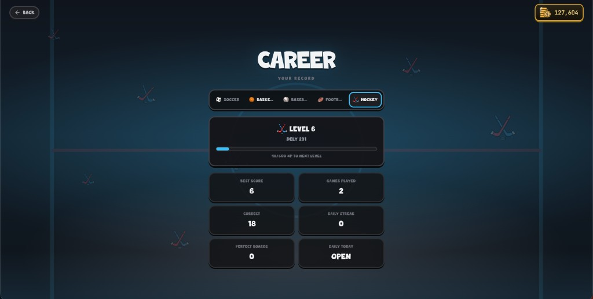<br />
      <sub>Career · per-sport record</sub>
    </td>
    <td width="50%" align="center">
      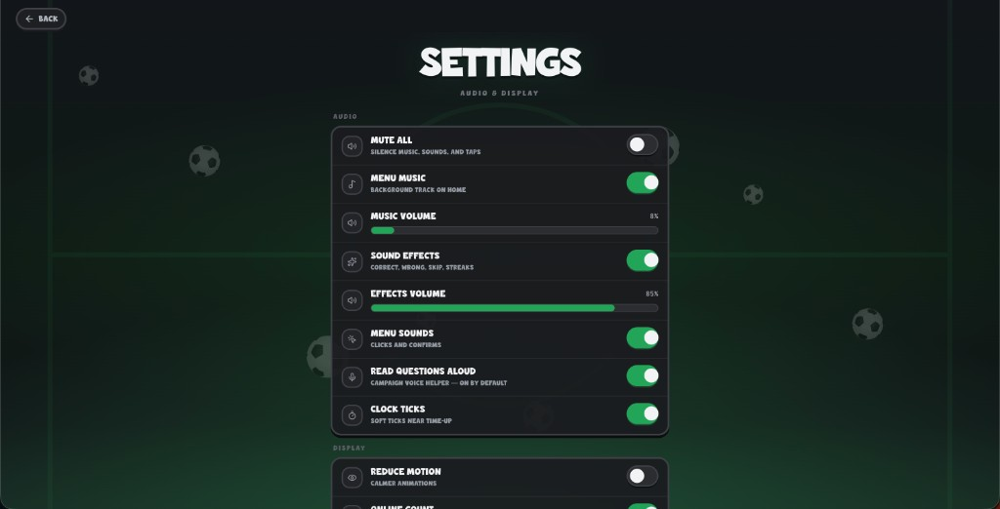<br />
      <sub>Settings · audio & display</sub>
    </td>
  </tr>
</table>

---

## What’s inside

A dense sports knowledge + presentation layer, not a thin trivia wrapper.

| Layer | Scale (approx.) |
| --- | ---: |
| Sports | **5** — soccer · basketball · baseball · football · hockey |
| Campaign stages | **40** — 4 chapters · gate bonuses at 10/20/30/40 |
| Athletes in data | **1,000+** rostered players |
| Local portraits | **600+** faces under `public/faces/` |
| 3D skins | **20+** characters / variants |
| Pets | **13** companions |
| GLB / FBX models | **45+** files under `public/models/` |
| Card art | **20** card renders |
| Categories | **250+** category definitions & intersections |
| React screens / components | **35+** UI modules |
| Domain libs | **25+** modules (`src/lib`) |
| Game hooks | **8+** (board, duel, campaign trivia, audio…) |
| Duel + voice server | Node `ws` lobbies + campaign TTS route |
| TypeScript app source | **~22k** lines across `src/` |
| Tooling scripts | **14** data / face / build utilities |

### Athlete data by sport

| Sport | Roster size (incl. extras) |
| --- | ---: |
| Soccer | ~390 |
| Basketball | ~196 |
| Baseball | ~144 |
| Football | ~95 |
| Hockey | ~195 |

Rosters carry clubs, leagues, nations, trophies, decades, and sport-specific fields so category boards stay fair and deep.

### Recent highlights

- **Campaign mode** — 40-stage path, stars, chapter gates, podium milestones, deep championship trivia.
- **About guide** — scrollable feature tour with embedded demo videos per section.
- **Sport-first home** — neutral first launch, sport pick modal, persisted preferred sport.
- **Character polish** — home showcase animations, multi-slot color kits, entry splash.
- **Campaign voice** — neural TTS for question read-aloud (server-side, toggle in Settings).
- **UX pass** — Play/Campaign CTA styling, level corner HUD, sport rail, daily spin chip.

---

<a id="architecture"></a>

## Architecture

```text
┌──────────────────────────────────────────────────────────┐
│  React 19 + Vite 8 + Tailwind 4                          │
│  Home · Modes · Board · Campaign · Store · Cards · About  │
│  Framer Motion UI · Lucide icons                         │
├────────────────────────────┬─────────────────────────────┤
│  @react-three/fiber        │  Profile (localStorage)     │
│  drei · Three.js           │  coins · XP · unlocks       │
│  skins · pets · pedestals  │  card levels · PvP W-L-T    │
│  loadouts · flourishes     │  campaign progress · spin   │
├────────────────────────────┴─────────────────────────────┤
│  Game engine (hooks)                                     │
│  board gen · timers · scoring · bot AI · stakes          │
│  campaign trivia · chapter gates · voice client          │
├──────────────────────────────────────────────────────────┤
│  Node server (tsx)                                       │
│  duel WebSocket lobbies · campaign voice (Edge TTS)       │
└──────────────────────────────────────────────────────────┘
```

### Tech stack

| Area | Choices |
| --- | --- |
| UI | React 19, TypeScript, Tailwind CSS 4, Framer Motion, Lucide |
| 3D | Three.js, React Three Fiber, Drei |
| Build | Vite 8, `tsc -b`, oxlint |
| Realtime | Node.js, `ws`, concurrent Vite + duel process |
| Voice | `msedge-tts` on duel server for campaign read-aloud |
| Persistence | Client profile storage (coins, unlocks, stats, spin cooldown, loadouts) |
| Assets | Local faces, GLB/FBX models, card PNGs, SFX, sport chrome, About demos |

### Notable product systems

- **Sport theme engine** — backgrounds, accents, balls, and hub chrome swap with the selected sport.
- **Board generation** — category intersections validated against athlete metadata.
- **Campaign progression** — stars, unlock rules, gate payouts, chapter UI, deep trivia injection.
- **Portrait pipeline** — localized faces + override scripts (`scripts/localizeSoccerFaces.mts`, etc.).
- **Economy** — coins, bot stakes, duel pots, card upgrades, daily spin weights, campaign streak 2×.
- **Cosmetic loop** — store skins/pets, per-character loadouts, hub showcase, unlock fanfare.
- **Cards** — overall ratings, rarity, free-upgrade bank, Icon/99 presentation.
- **Duels** — lobby codes, host/ready, stake presets, matchup cards, live score HUD.

---

<a id="play"></a>

## Play / deploy

**Live:** [https://sportivia.xyz/](https://sportivia.xyz/)

**GitHub Pages cannot host the duel server** (static only — no WebSockets). The production build runs on Railway with the static client and duel WebSocket together. You can also ship the full app to Render or similar.

### One-click Render

[Deploy on Render](https://render.com/deploy?repo=https://github.com/delvinsalman/Sportivia)

### From this machine

```bash
npm install
npm run build
npm start          # serves dist/ + WebSocket on /duel
```

---

## Local development

```bash
npm install
npm run dev:all    # Vite + duel WebSocket server (+ campaign voice API)
```

Open `http://localhost:5173`. Duels proxy through Vite to `/duel`. Campaign voice hits `/api/campaign-voice` on the duel server.

| Script | Purpose |
| --- | --- |
| `npm run dev` | Frontend only |
| `npm run duel` | WebSocket server only |
| `npm run dev:all` | Both |
| `npm run build` | Production client build |
| `npm run build:itch` | Relative-base itch.io build |
| `npm run audit:data` | Roster / category audits |
| `npm run lint` | oxlint |

**Node:** `>= 22.12.0`

---

## Repo map

```text
src/
  components/     screens + HUD (home, board, campaign, store, cards, about…)
  hooks/          game board, duel client, campaign trivia, audio, profile
  lib/            themes, bots, stakes, faces, cards, spin, campaign storage
  data/           athletes + categories per sport
  types/          profile, characters, pets, campaign, loadouts
server/           duel WebSocket + campaign voice API
public/
  faces/          localized athlete portraits
  models/         GLB / FBX skins & pets
  demos/          About screen feature clips
  cards/          card art
  icons/          modes, spin, chrome
docs/readme/      README screenshots + gameplay capture
scripts/          face localize, audits, transforms
```

---

## Gallery

<p align="center">
  
  
</p>
<p align="center">
  
  
</p>
<p align="center">
  
</p>
<p align="center">
  
  
  
</p>
<p align="center">
  
  
</p>
<p align="center">
  
  
</p>

---

<a id="credits"></a>

## Credits

I’ve put a lot of work into Sportivia myself — the idea, the systems, the polish, and the long haul of building it out. [Cursor](https://cursor.com) helped as a support tool along the way, especially on a project this data-heavy: rosters, faces, wiring, refactors, and the kind of repo grunt work that keeps everything crisp. Using AI that way let me move faster without handing over the creative or product direction.

---

<p align="center">
  <strong>Sportivia</strong> — five sports · one board · 40-stage campaign · built for speed.<br />
  <a href="https://sportivia.xyz/">Play live</a>
  ·
  <a href="https://github.com/delvinsalman/Sportivia">GitHub</a>
</p>
